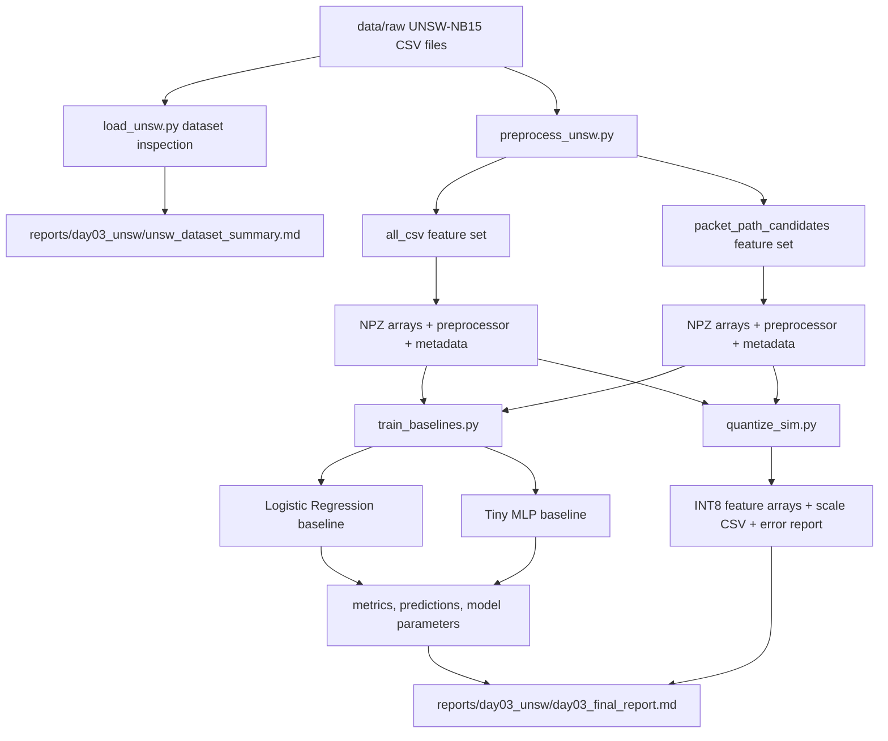

# SafeHy-TinyNID Day 03 Pipeline

This file documents the Day 03 software baseline pipeline for UNSW-NB15. The spelling `pipline.md` follows the requested file name; it describes the project pipeline, not a production IDS pipeline.

## Research Boundary

Day 03 supports the software-baseline part of SafeHy-TinyNID:

1. Understand UNSW-NB15 CSV features and labels.
2. Prevent obvious leakage from `id`, `label`, and `attack_cat`.
3. Train small reproducible baselines: Logistic Regression and Tiny MLP.
4. Compare a full CSV feature set against a more hardware-oriented candidate subset.
5. Run a first INT8 feature quantization sanity check.

It does not claim FPGA latency, throughput, timing closure, or packet-path hardware performance.

## Flow Diagram



## Input Files

```text
data/raw/UNSW_NB15_training-set.csv
data/raw/UNSW_NB15_testing-set.csv
data/raw/NUSW-NB15_features.csv
```

The feature dictionary is accepted as `NUSW-NB15_features.csv` because that is the local filename. The code also supports the expected `UNSW-NB15_features.csv` spelling.

## Python Files

| File | Main Role | Important Inputs | Main Outputs |
|---|---|---|---|
| `python/feature_utils.py` | Shared constants and feature classification utilities. | UNSW column names. | Feature categories, selected feature lists, missing-token normalization. |
| `python/eval_metrics.py` | Shared binary classification metrics. | `y_true`, `y_pred`, optional attack score. | Accuracy, precision, recall, F1, AUC, FPR, FNR, confusion matrix counts. |
| `python/load_unsw.py` | Dataset inspection and report generation. | Raw train/test CSV and feature dictionary. | `unsw_dataset_summary.json`, `unsw_dataset_summary.md`. |
| `python/preprocess_unsw.py` | Train-split-fitted preprocessing for model inputs. | Raw CSV files and feature mode. | Compressed arrays, sklearn preprocessor, metadata JSON, preprocessing report. |
| `python/train_baselines.py` | Train Logistic Regression and Tiny MLP baselines. | Preprocessed `.npz`, seed, model options. | Metrics, model `.joblib`, full parameter JSON, train/test predictions, manifest. |
| `python/quantize_sim.py` | Symmetric per-feature INT8 quantization simulation. | Preprocessed `.npz`. | INT8 arrays, dequantized arrays, scale CSV, quantization error report. |

## File Structure Details

### `feature_utils.py`

Key constants:

```text
LABEL_COLUMN = "label"
ATTACK_COLUMN = "attack_cat"
ID_COLUMN = "id"
TARGET_OR_LEAKAGE_COLUMNS = {"id", "label", "attack_cat"}
```

Key functions:

| Function | Purpose |
|---|---|
| `resolve_unsw_files(data_dir)` | Finds train/test CSV and accepts either `UNSW-NB15_features.csv` or local typo `NUSW-NB15_features.csv`. |
| `feature_path_category(column)` | Labels a feature as packet-path candidate, flow-lite candidate, stateful flow feature, or leakage/target. |
| `selected_packet_path_columns(columns)` | Selects early hardware-oriented candidate columns. |
| `input_feature_columns(columns)` | Drops `id`, `label`, and `attack_cat`. |
| `normalize_missing_values(df)` | Normalizes blank-like missing tokens. It does not treat `-` as missing because UNSW uses it as a common categorical value. |
| `infer_feature_types(df, columns)` | Separates numerical and categorical features. |
| `feature_catalog(columns)` | Builds a report-friendly feature review table. |

### `eval_metrics.py`

Key functions:

| Function | Purpose |
|---|---|
| `binary_classification_metrics(...)` | Computes accuracy, precision, recall, F1, AUC, FPR, FNR, TN, FP, FN, TP. |
| `write_metrics_json(...)` | Saves detailed metrics to JSON. |
| `write_metrics_csv(...)` | Saves tabular metrics to CSV. |

The positive class is `label = 1`, meaning attack.

### `load_unsw.py`

CLI:

```powershell
python python/load_unsw.py --data-dir data/raw --out-dir reports/day03_unsw
```

Main internal flow:

1. Resolve UNSW files.
2. Load train/test CSVs.
3. Confirm `label` and `attack_cat`.
4. Count rows, columns, missing values, binary labels, and attack categories.
5. Separate numerical and categorical features.
6. Classify each column for packet-path suitability.
7. Write JSON and Markdown reports.

Outputs:

```text
reports/day03_unsw/unsw_dataset_summary.json
reports/day03_unsw/unsw_dataset_summary.md
```

### `preprocess_unsw.py`

CLI for complete CSV software baseline:

```powershell
python python/preprocess_unsw.py --data-dir data/raw --out-dir data/processed/unsw_day03 --summary-dir reports/day03_unsw --feature-mode all_csv
```

CLI for early packet-path-oriented candidate subset:

```powershell
python python/preprocess_unsw.py --data-dir data/raw --out-dir data/processed/unsw_day03 --summary-dir reports/day03_unsw --feature-mode packet_path_candidates
```

Main internal flow:

1. Load train/test CSV.
2. Drop `id`, `label`, and `attack_cat` from model input.
3. Select either all remaining CSV fields or packet-path candidate fields.
4. Fit numerical median imputation + standard scaling on train only.
5. Fit categorical most-frequent imputation + one-hot encoding on train only.
6. Transform train/test with the same fitted preprocessor.
7. Save arrays, preprocessor, metadata, and report.

Outputs:

```text
data/processed/unsw_day03/unsw_all_csv_preprocessed.npz
data/processed/unsw_day03/unsw_all_csv_preprocessor.joblib
data/processed/unsw_day03/unsw_all_csv_metadata.json
reports/day03_unsw/unsw_all_csv_preprocess.md

data/processed/unsw_day03/unsw_packet_path_candidates_preprocessed.npz
data/processed/unsw_day03/unsw_packet_path_candidates_preprocessor.joblib
data/processed/unsw_day03/unsw_packet_path_candidates_metadata.json
reports/day03_unsw/unsw_packet_path_candidates_preprocess.md
```

### `train_baselines.py`

CLI:

```powershell
python python/train_baselines.py --processed-npz data/processed/unsw_day03/unsw_all_csv_preprocessed.npz --out-dir reports/day03_unsw --model-dir data/processed/unsw_day03/models --seed 42 --models all --mlp-hidden 32 --mlp-max-iter 100
```

Main internal flow:

1. Load preprocessed train/test arrays.
2. Load feature metadata if available.
3. Train Logistic Regression with class balancing.
4. Train Tiny MLP with one hidden layer of 32 neurons and early stopping.
5. Evaluate train and test splits.
6. Save trained models.
7. Save full model parameters:
   - Logistic Regression coefficients and intercept.
   - MLP layer weights and biases.
8. Save train/test predictions and attack scores.
9. Save metrics CSV, detailed JSON, Markdown report, and manifest.

Important model settings:

| Model | Key Settings |
|---|---|
| Logistic Regression | `max_iter=1000`, `class_weight=balanced`, `random_state=42` |
| Tiny MLP | `hidden_layer_sizes=(32,)`, `activation=relu`, `batch_size=256`, `learning_rate_init=0.001`, `early_stopping=True`, `max_iter=100`, `random_state=42` |

### `quantize_sim.py`

CLI:

```powershell
python python/quantize_sim.py --processed-npz data/processed/unsw_day03/unsw_all_csv_preprocessed.npz --out-dir data/processed/unsw_day03/quantized --report-dir reports/day03_unsw
```

Main internal flow:

1. Load preprocessed FP32 feature arrays.
2. Compute one symmetric INT8 scale per transformed feature from training data:

```text
scale_i = max(abs(X_train[:, i])) / 127
```

3. Quantize train/test features to signed INT8.
4. Dequantize for error analysis.
5. Save INT8 arrays, scale CSV, JSON summary, and Markdown summary.

This is feature quantization only. It does not yet quantize trained model weights or activation ranges.

## Current Day 03 Results

Dataset:

| Split | Rows | Columns |
|---|---:|---:|
| Train | 175341 | 45 |
| Test | 82332 | 45 |

Feature modes:

| Feature Mode | Raw Selected Features | Numerical | Categorical | Transformed Dimension |
|---|---:|---:|---:|---:|
| `all_csv` | 42 | 39 | 3 | 194 |
| `packet_path_candidates` | 18 | 15 | 3 | 170 |

Best Day 03 software result by test F1:

| Feature Mode | Model | Test Accuracy | Test F1 | Test AUC |
|---|---|---:|---:|---:|
| `all_csv` | Tiny MLP | 0.856957 | 0.882278 | 0.973794 |
| `packet_path_candidates` | Tiny MLP | 0.813402 | 0.854692 | 0.961851 |

Objective interpretation:

The packet-path candidate subset keeps high attack recall but has a high false positive rate. This is useful evidence for the next stage: we should not simply deploy these CSV-derived candidates as final hardware features. We need parser-derived hybrid features, threshold calibration, and later safe adaptation experiments.

## Paper Connection

This pipeline supports:

1. Contribution 1: early comparison between flow-heavy CSV features and hardware-oriented candidate features.
2. Contribution 2: model-selection baseline before fixed-point TinyML hardware design.
3. Contribution 3: a fixed-model baseline required before any safe bounded adaptation claim.

It does not yet support:

1. FPGA resource/timing claims.
2. External 10G/40G throughput claims.
3. Online adaptation safety claims.
4. Final packet-path hybrid-feature accuracy claims.
